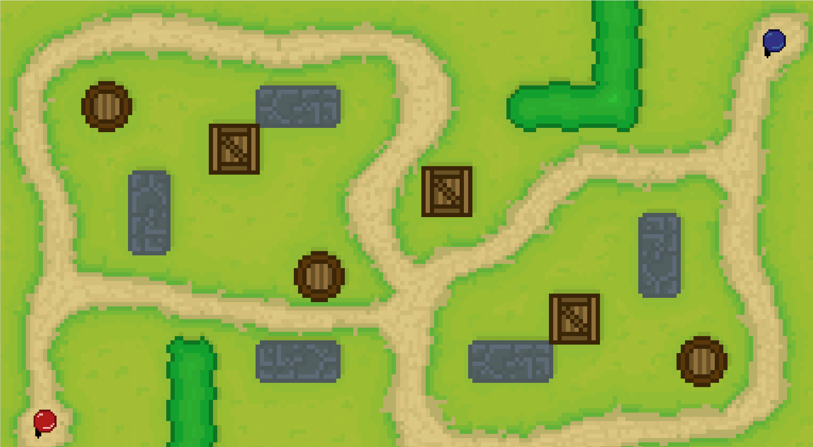

# Digital Duel

**Digital Duel** is a bird's-eye view 1v1 2D shooter built in C using SDL2.

Two players battle in a minimalist arena full of obstacles and bullets. It features local multiplayer gameplay, a smooth game loop, and transitions through Menu → Game → Game Over → Menu.

---

## Gameplay Overview

- **Player 1** (🔴 Red)

  - Move: `W`, `A`, `S`, `D`
  - Shoot: `E`

- **Player 2** (🔵 Blue)

  - Move: Arrow keys
  - Shoot: `/`

- Bullets travel in a straight line and collide with players or boundaries.
- The game ends when one player hits the other, then returns to the menu after a short Game Over screen.

---

## Screenshots





---

## 📦 Requirements

### Linux / WSL:

```bash
sudo apt install libsdl2-dev libsdl2-image-dev
```

### Windows:

Download and place the following files next to your compiled executable (`DigitalDuel.exe`):

- `SDL2.dll`
- `SDL2-2.30.10-win32-x64/`
- `SDL2_image-2.0.0-win32-x64/`

Download them from:

- [SDL2 Releases](https://github.com/libsdl-org/SDL/releases)
- [SDL2_image Releases](https://github.com/libsdl-org/SDL_image/releases)

---

## 🔧 Build Instructions

### Linux / WSL:

```bash
gcc src/main.c src/menu.c src/game.c util/util.c -o DigitalDuel -lSDL2 -lSDL2_image -lm
```

### Windows:

Use a compiler like MinGW and link the SDL2 libraries. Make sure the `.dll` files are next to `DigitalDuel.exe` when running.

---

## ▶️ How to Run

### Linux:

```bash
./DigitalDuel
```

### Windows:

Double-click `DigitalDuel.exe` (ensure the SDL2 DLLs are present).

---

## 🗂️ Folder Structure

```
.
├── src/
│   ├── main.c
│   ├── menu.c
│   └── game.c
├── util/
│   ├── util.c
│   ├── util.h
│   ├── global.h
│   └── include.h
├── assets/
│   └── images/
│       ├── sky.png
│       ├── map.png
│       ├── menu.png
│       ├── redplayer.png
│       ├── blueplayer.png
│       ├── bullet.png
│       └── gameover.png
├── DigitalDuel               # Compiled binary
|── README.md
```

---

## 🛠 Known Issues / Ideas

- No sound/music yet
- Max 10 bullets per player (static array)
- Would be fun to see someone add:
  - Health bars
  - Power-ups
  - Weapon changes
  - supply drops
  - audio

---

## 🌐 License

This project is **public domain / open-source**.

You can:

- Use it in your own projects
- Modify it
- Distribute it
- Learn from it

No attribution required

---

## 👋 Contributing

Pull requests and forks are welcome. If you'd like to add a new mechanic, fix bugs, or help polish the codebase, feel free to contribute!

---

## 🧑‍💻 Author

Built by **Ali Hamoudi** — powered by SDL2, C, and way too much debugging.
